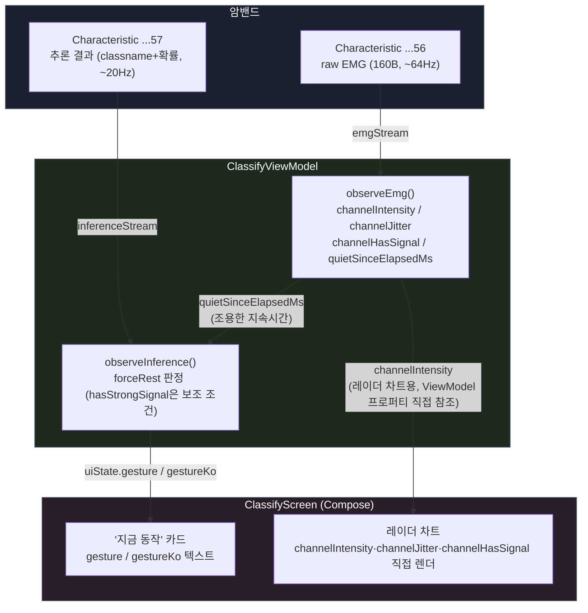
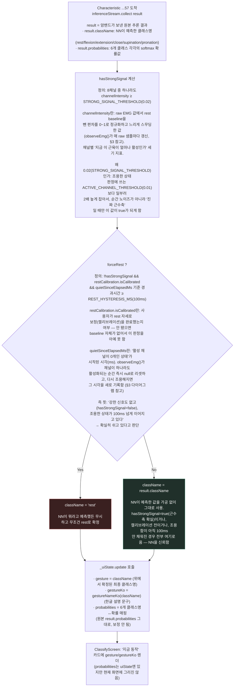
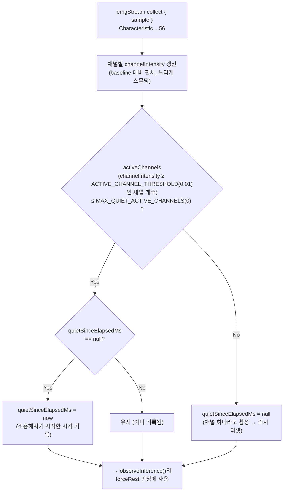

# 추론 결과 판정 및 화면 표시 흐름

> 관련 파일: [`ClassifyViewModel.kt`](../presentation/ui/classify/ClassifyViewModel.kt),
> [`ClassifyScreen.kt`](../presentation/ui/classify/ClassifyScreen.kt)
>
> 암밴드가 BLE로 추론 결과를 보내온 뒤, 앱이 이를 그대로 쓰지 않고 어떤 후처리를
> 거쳐 화면에 보여주는지 정리한 문서. 배경 논의는 [`RECOGNITION_IMPROVEMENT.md`](RECOGNITION_IMPROVEMENT.md) 참고.

---

## 1. 전체 흐름 개요

암밴드는 두 개의 BLE Characteristic을 통해 서로 다른 두 종류의 데이터를 계속 보낸다.
`ClassifyViewModel`은 이 둘을 동시에 구독하면서, **추론 결과(`...57`)를 raw EMG(`...56`)
기반 신호 세기로 보정**한 뒤 화면에 반영한다.



**핵심 포인트**
- `channelIntensity`/`channelJitter`는 `_uiState`(StateFlow)를 거치지 않고 `ClassifyScreen`이
  `viewModel.channelIntensity`를 **매 프레임 직접 읽는다** (Compose recomposition 없이 Canvas가
  매 프레임 다시 그림) — 레이더 차트는 60Hz로 흔들리지만 상태 갱신 오버헤드는 없음.
- `gesture`/`gestureKo`/`probabilities`만 `uiState`(StateFlow)로 나가서 일반적인 Compose
  recomposition 경로를 탄다.
- `probabilities`는 `uiState`에 채워지긴 하지만, 현재 `ClassifyScreen.kt`에서 화면에
  렌더링하는 곳은 없다(추후 사용 대비 또는 디버깅용으로 보임).

---

## 2. `observeInference()` 판정 로직 (핵심)

BLE로 받은 `result.className`을 그대로 쓰지 않고, **raw 신호 세기 기반으로 rest 강제
판정만** 적용한다.

> **2026-08-20 변경**: 이전엔 "강한 신호 채널이 있는데 NN이 rest로 예측하면 2등 확률
> 클래스로 대체"하는 분기(`bestNonRestClassName`)가 있었는데, 오분류 위험이 더 크다고
> 판단해서 제거함. 이제 `hasStrongSignal`은 오직 `forceRest` 조건을 막는 용도로만 쓰임 —
> "강한 신호가 있으면 rest로 강제 덮어쓰지 않는다"까지만 하고, NN이 rest 외의 다른 걸
> 예측하도록 강제로 바꾸는 로직은 없음.



```kotlin
val hasStrongSignal = channelIntensity.any { it >= STRONG_SIGNAL_THRESHOLD }

val forceRest = !hasStrongSignal && restCalibration.isCalibrated &&
    quietSinceElapsedMs?.let {
        SystemClock.elapsedRealtime() - it >= REST_HYSTERESIS_MS
    } == true

val className = if (forceRest) "rest" else result.className
```

---

## 3. `observeEmg()` — 판정에 필요한 입력을 채우는 곳

`forceRest` 판정에 쓰이는 `quietSinceElapsedMs`는 raw EMG 스트림(`...56`)에서 매 샘플마다
갱신된다. **raw EMG 구독이 꺼져 있으면 이 스트림 자체가 안 들어와서 이 로직 전체가 멈춘다**
(전력 절약 설정, [`FIRMWARE_PROTOCOL.md`](FIRMWARE_PROTOCOL.md) §3 참고).



---

## 4. 화면 표시 요약

| UI 요소 | 데이터 출처 | 비고 |
|---|---|---|
| "지금 동작" 카드 (`gesture`, `gestureKo`) | `uiState` (StateFlow, `observeInference()`가 갱신) | 위 §2 판정 로직을 거친 최종 클래스명 |
| 레이더 차트 (채널별 세기/떨림) | `viewModel.channelIntensity` / `channelJitter` (프로퍼티 직접 참조) | raw 구독 꺼져있으면(`uiState.rawStreamEnabled == false`) 아예 안 그림 (`ClassifyScreen.kt:207`) |
| 채널 선 색상 (진하게/옅게) | `channelHasSignal[ch]` | raw 값 자체의 최근 스프레드 기반 — intensity와 무관하게 "센서가 살아있는가"만 봄 |
| 연결 상태 배지 | `uiState.bleState` | `observeBleState()`가 갱신 |

---

## 5. 임계값 요약

| 상수 | 값 | 용도 |
|---|---|---|
| `ACTIVE_CHANNEL_THRESHOLD` | 0.01 | "조용한 상태" 판정 시 채널이 활성인지 여부 (§3) |
| `MAX_QUIET_ACTIVE_CHANNELS` | 0 | 활성 채널이 이 개수 이하일 때만 "조용함"으로 침 (2026-07-21부터 0 — 채널 하나라도 뛰면 즉시 리셋) |
| `REST_HYSTERESIS_MS` | 100ms | 조용한 상태가 이만큼 지속돼야 `forceRest` 발동 |
| `STRONG_SIGNAL_THRESHOLD` | 0.02 | `ACTIVE_CHANNEL_THRESHOLD`보다 높게 잡아, 노이즈가 아니라 "진짜 근수축"일 때만 `forceRest`를 막음 (2등 확률 대체 로직은 제거됨) |
